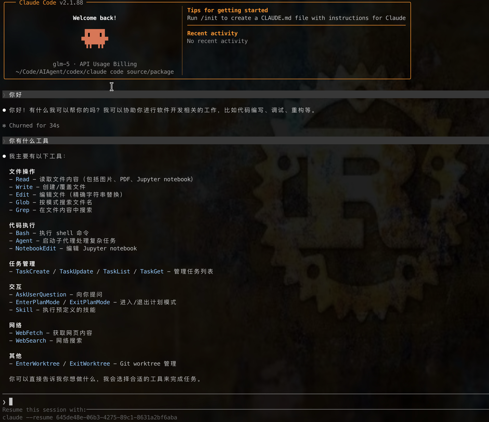

# Claude Code Reverse Build Notes

这个目录记录了从 `@anthropic-ai/claude-code` 发布包反推源码和重建 external CLI 的过程。

当前状态：
- 已通过 `reverse-sourcemap` 还原出 `cli/`
- external 工作区已经整理为 `package/cli`（包含 vendor-deps、node_modules、构建脚本）
- 已生成可执行产物 `package/dist/cli.external.js`
- `auto-mode defaults` 输出已和官方 `cli.js` 对齐


## 0. 效果图



## 1. 获取发布包和 sourcemap

```sh
npm i @anthropic-ai/claude-code
cp node_modules/@anthropic-ai/claude-code/cli.js .
cp node_modules/@anthropic-ai/claude-code/cli.js.map .
npm install --global reverse-sourcemap
reverse-sourcemap -o cli -v cli.js.map
```

## 2. 目录说明

- `package/cli/`: 归一化后的 external workspace（src、vendor、vendor-deps、node_modules、package.json、bun.lock）
- `package/dist/cli.external.js`: 当前重建产物
- `package/dist/cli.external.js.map`: 对应 sourcemap
- `package/vendor/`: 需要保留的 native/vendor 源
- 根目录 `cli.js` / `cli.js.map`: 官方发布包原始文件

## 3. 安装依赖

External workspace 已经包含完整的 `package.json` / `bun.lock`，直接在目录内安装即可：

```sh
cd package/cli
bun install --frozen-lockfile
```

如需重新校准依赖，可结合 `cli.js.map` 和 `node_modules` 自行审计并更新 `package/cli/package.json`。

## 4. 重建 external CLI

所有构建脚本都写在 `package/cli/package.json` 里，通过 Bun 运行：

```sh
cd package/cli
bun run build:external          # 单次构建
bun run build:external:watch    # watch 模式
```

底层命令等价于：

```sh
bun build src/entrypoints/cli.tsx \
  --outdir ../dist \
  --entry-naming cli.external.js \
  --target node \
  --format esm \
  --sourcemap=linked \
  --minify \
  --banner '#!/usr/bin/env node'
```

## 5. 验证

```sh
node dist/cli.external.js --version
node dist/cli.external.js --help
node dist/cli.external.js auto-mode defaults
```

官方产物对比：

```sh
node cli.js auto-mode defaults
node dist/cli.external.js auto-mode defaults
```

## 6. 当前已知结论

- external 构建入口应走 `src/entrypoints/cli.tsx`，不能直接打 `main.tsx`
- 公开版 Commander 对 `-d2e` 不兼容，重建脚本里做了 argv 归一化
- `auto_mode_system_prompt.txt` 和 `permissions_external.txt` 不在磁盘源码里，而是内嵌在官方 `cli.js` 中；重建脚本会自动提取它们

## 7. 二次开发流程

1. **准备环境**
   - Node.js ≥ 18、npm ≥ 10
   - [Bun](https://bun.sh/)（`build-external.mjs` 走 `bun build`）
   - macOS 如果要跑系统集成代码，需要允许访问 `defaults` 等 CLI

2. **拉依赖**
   ```sh
   cd package
   node analyze-external-deps.mjs         # 确认 manifest 完整
   npm install --ignore-scripts --no-audit --no-fund
   ```

3. **开发/调试构建**
   ```sh
   cd package/cli
   bun run build:external -- --no-minify   # 可传递额外 bun build flag
   node ../dist/cli.external.js --help
   ```
   - 修改 `package/cli/**` 后直接重复 `bun run build:external`
   - Feature/Env/Macro 相关常量现在直接写在源码里（不再依赖单独 profile 文件）

4. **本地验证**
   ```sh
   node dist/cli.external.js --version
   node dist/cli.external.js auto-mode defaults
   node dist/cli.external.js --help
   ```
   与官方二进制对比：
   ```sh
   diff <(node cli.js auto-mode defaults) \
        <(node dist/cli.external.js auto-mode defaults)
   ```

5. **出包**
   ```sh
   cd package
   node build-external.mjs \
     --out dist/claude-code-cli.js \
     --version 2.1.88 \
     --build-time "$(date -u +%Y-%m-%dT%H:%M:%SZ)" \
     --package-url @anthropic-ai/claude-code
   cp package.external.json package.json
   npm pack
   ```
   - 发布前务必运行 `node build-external.mjs --check`
   - 如需生成 sourcemap，保持 `externalBundleProfile.sourcemap = 'linked'`


